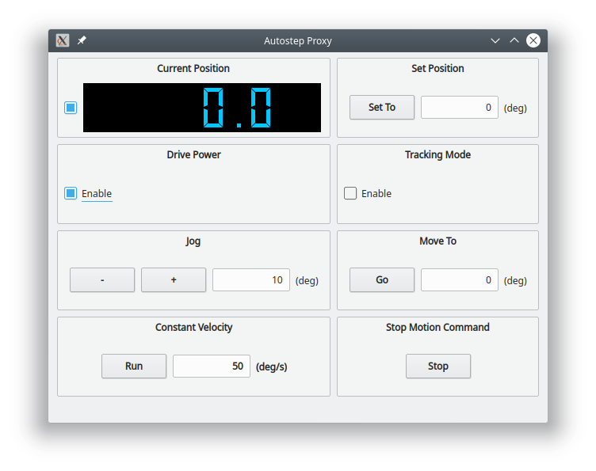

# autostep_ros 

ROS interface to [autostep](http://github.com/willdickson/autostep) motion
control library.  Developed for control various mechanical components used to
study insect behavior. For example, it is used to control a rotating platform
for certain tethered flight experiments and for controlling a rotating wind
tunnel which tracks the real-time orientation of fly on a 1-DOF magnetic
tether.


## Installation

1. Install ROS. Instructions can be found [here](http://wiki.ros.org/kinetic/Installation/Ubuntu) 
if you have not already done this.  Tested with ros kinetic, desktop install

2. Setup your catkin workspace.  Instructions can be found [here](http://wiki.ros.org/catkin/Tutorials/create_a_workspace) 
if you have not already done this. 
    
3. Download and install the autostep python library from [here](http://github.com/willdickson/autostep)

3. Then clone the git repository and run catkin make.

```bash
$cd ~/catkin_ws/src
$git clone https://github.com/willdickson/autostep_ros.git
$cd ~/catkin_ws
$catkin_make

```

## Launch files 

* Launching the autostep_node

```bash

roslaunch autostep_ros autostep.launch

``` 

* Launching the autoste_proxy_app

```bash

roslaunch autostep_ros autostep_proxy_app.launch

``` 

* Launching the autostep_node and  autoste_proxy_app

```bash

roslaunch autostep_ros autostep_and_proxy_app.launch

``` 

## Autostep proxy app GUI




